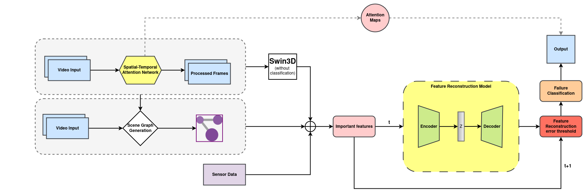
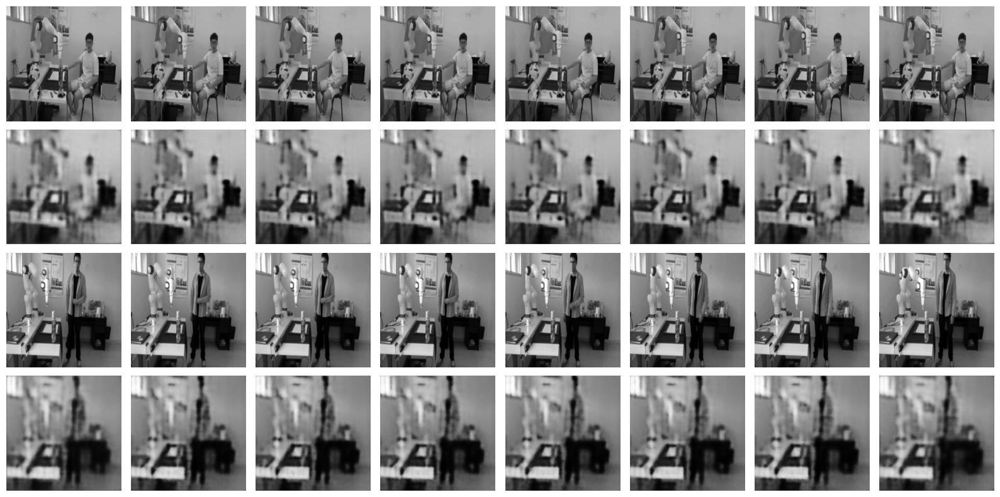
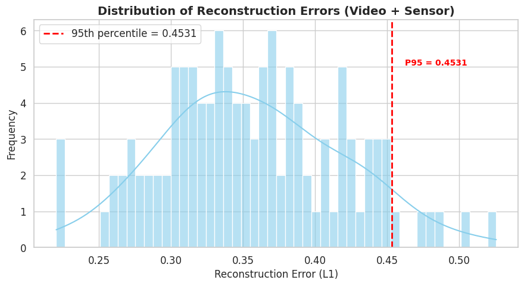
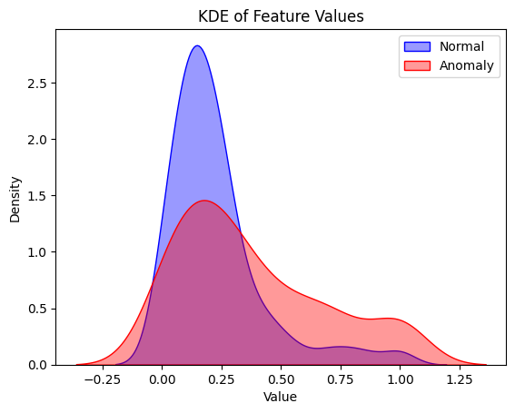
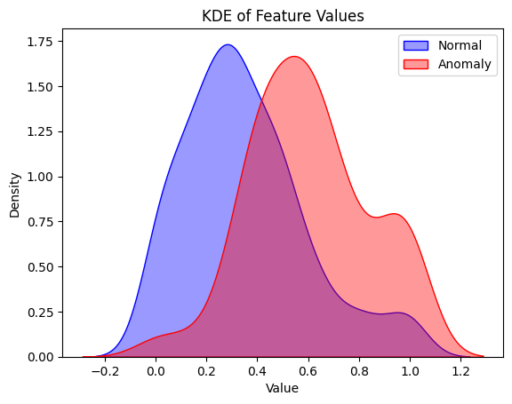
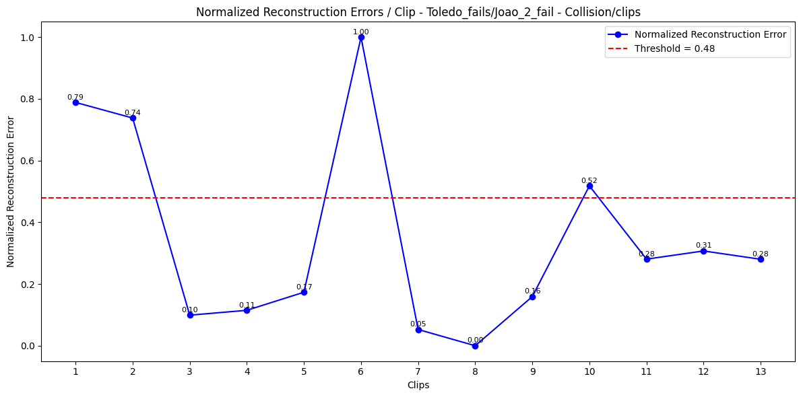
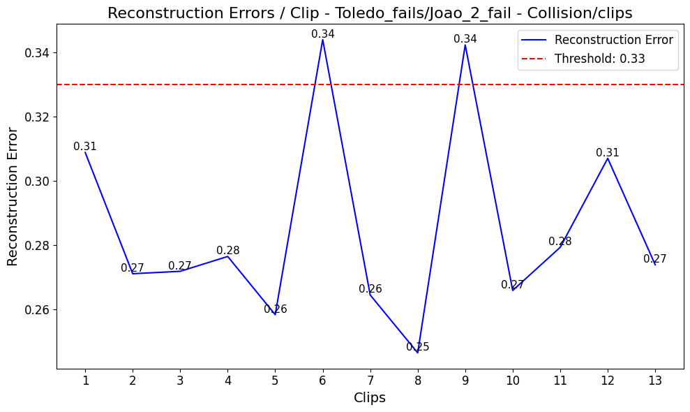
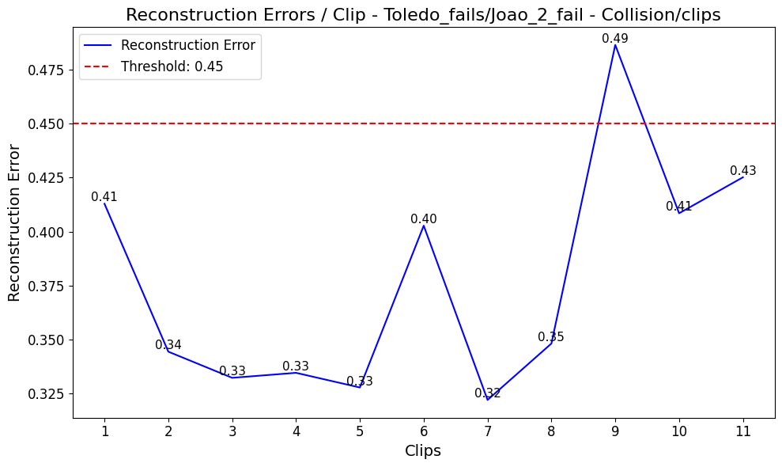
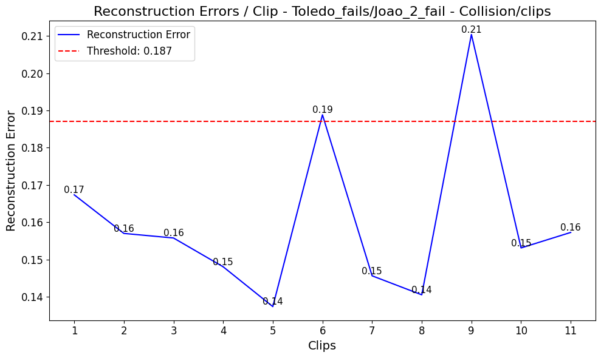
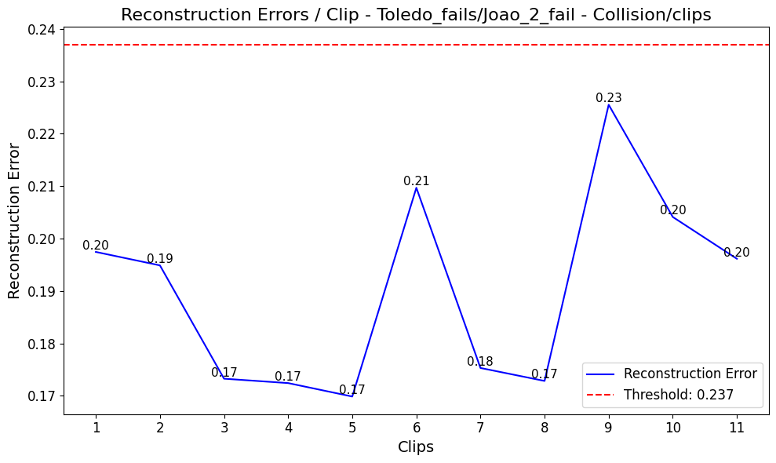

# MADRI : Multimodal Anomaly Detection for Human-Robot Interaction

## Abstract

Ensuring safety and reliability in human-robot interaction (HRI) requires the timely detection of unexpected events that could lead to system failures or unsafe behaviours. 
Anomaly detection thus plays a critical role in enabling robots to recognize and respond to deviations from normal operation during collaborative tasks. 
While reconstruction models have been actively explored in HRI, approaches that operate directly on feature vectors remain largely unexplored. 
In this work, we propose MADRI, a framework that first transforms video streams into semantically meaningful feature vectors before performing reconstruction-based anomaly detection. 
Additionally, we augment these visual feature vectors with the robot’s internal sensors' readings and a Scene Graph, enabling the model to capture both external anomalies in the visual environment and 
internal failures within the robot itself. To evaluate our approach, we collected a custom dataset consisting of a simple pick-and-place robotic task under normal and anomalous conditions. 
Experimental results demonstrate that reconstruction on vision-based feature vectors alone is effective for detecting anomalies, while incorporating other modalities further improves detection performance, 
highlighting the benefits of multimodal feature reconstruction for robust anomaly detection in human-robot collaboration.

## Methodology

### Action Recognition for Human-Robot Interaction

To adapt the Swin Transformer—originally pre-trained on the Kinetics dataset—we fine-tuned it for our specific task of action recognition in human-robot interaction scenarios. This process allowed the model to better capture the nuances of our dataset.

### Baseline Model: Full Clip Reconstruction

As a benchmark, we developed a baseline model focused on full clip reconstruction. This model uses an autoencoder architecture to reconstruct input clips and computes the loss between the original and reconstructed outputs. For more technical details, refer to our paper.

### Anomaly Detection Threshold

To define the anomaly detection threshold, we analyzed the distribution of normal validation data. By identifying the 95th percentile, we established a cutoff: any value exceeding this threshold during inference is flagged as anomalous.

## Results:

Our analysis of ROC curves, KDE plots, and reconstruction results highlights the advantages of operating in a semantic space rather than relying on pixel-wise reconstruction. Even the video-only framework outperformed the baseline. However, the instability of the Scene Graph Generator introduced more penalties than benefits, impacting overall performance.

## Comparison: Baseline vs. All Modalities

The following KDE plots compare the baseline model with our multi-modal approach (MADRI):

| KDE for the Baseline | KDE for the MADRI (all modalities) |
| -------------------- | -------------------------------- |
|  |  |

### Reconstruction Performance by Failure Type

Below are reconstruction plots for different failure types, comparing the baseline model with various modalities:

| Failure Type         | Baseline | Video Only | Video + Sensor | Video + SG | All Modalities |
|----------------------|----------|------------|----------------|------------|----------------|
| Drop Cup             |  |  |  |  |  |
| Robot Torque Failure |  |  |  |  |  |
| Collision            ||  |  |  |  |
| Extra Person         |  |  |  |  |  |
| Person Disappears    |  |  |  |  |  |

## Model Weights available at: 

https://drive.google.com/drive/folders/1VdQBex_KjnO9MbtvfjZtfBq3zJHJHwMw?usp=sharing

